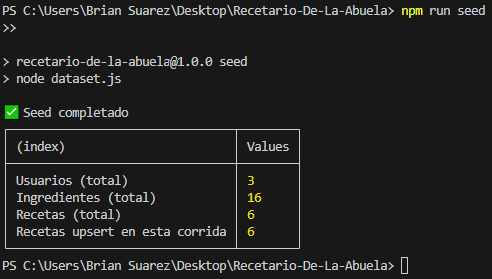

# 📚 Recetario-Familiar API

API REST para una **Plataforma de Recetas Culinarias**, desarrollada con **Node.js, Express y MongoDB**, que permite gestionar usuarios, recetas e ingredientes, además de buscar recetas por ingrediente y listar recetas por usuario.

## 🚀 Tecnologías usadas
- Node.js
- Express.js
- MongoDB
- Dotenv

## 📌 Objetivo
Implementar un backend que:
- Gestione usuarios (CRUD).
- Gestione recetas (CRUD, recetas por usuario).
- Gestione ingredientes (agregar, listar, eliminar).
- Busque recetas por ingrediente.

## ✏️ Plan de trabajo

## Paso 1️⃣ — Diseño de dominio

### Usuario -> Coleccionde usuarios que crearan recetas
- `_id` (MongoDB)
- `nombreUsuario` → ingresado por el usuario
- `email` → ingresado por el usuario (único)
- `createdAt`, `updatedAt` 

**Relación:** Un usuario puede tener muchas recetas.

**Ejemplo:**
```bash
{
  "_id": "689e7ce358f860faed90476c",
  "nombreUsuario": "Brian Suarez",
  "email": "briansuarez@fimail.com",
  "createdAt": "2025-08-14T00:00:00.000Z",
  "updatedAt": "2025-08-14T00:00:00.000Z"
}
```
---

### Receta -> Coleccion de recetas que que creran usuarios
- `_id` (MongoDB)
- `usuarioId` → referencia al `_id` de User
- `nombreReceta` → ingresado por el usuario
- `descripcion` → ingresado por el usuario
- `ingredientes` → array de objetos; Embebido de clase ingredentes
  - `_id` (MongoDB)
  - `nombre` 
  - `tipo` → (`Vegetal`, `Proteina`, `Condimento`, `Otro`)
  - `descripcion`
- `createdAt`, `updatedAt`

**Relación:** Una receta pertenece a un usuario y tiene varios ingredientes embebidos.

**Ejemplo:**
```bash
{
  "_id": "66b8f85ca2b5c9f1e0a33333",
  "usuarioId": "66b8f6f8a2b5c9f1e0a11111",
  "nombreReceta": "Arroz con pollo",
  "descripcion": "Receta clásica con verduras.",
  "ingredientes": [
    {
      "_id": "66b8f8d1a2b5c9f1e0a44444",
      "ingredienteId": "66b8f7a0a2b5c9f1e0a22222",
      "nombre": "arroz",
      "tipo": "Otro",
      "descripcion": "2 tazas de arroz blanco"
    },
    {
      "_id": "66b8f8e2a2b5c9f1e0a55555",
      "ingredienteId": "66b8f90aa2b5c9f1e0a66666",
      "nombre": "pollo",
      "tipo": "Proteina",
      "descripcion": "Pechuga en cubos"
    }
  ],
  "createdAt": "2025-08-14T00:00:00.000Z",
  "updatedAt": "2025-08-14T00:00:00.000Z"
}
```
---

### Ingredient
- `_id` (MongoDB)
- `nombre` → ingresado por el usuario 
- `tipo` → categoría (`Vegetal`, `Proteina`, `Condimento`, `Otro`) -> Seleccionado por el Usuario
- `descripcion` -> ingresado por el usurio
- `createdAt`, `updatedAt`

**Ejemplo:**
```bash
{
  "_id": "66b8f7a0a2b5c9f1e0a22222",
  "nombre": "arroz",
  "tipo": "Otro",
  "descripcion": "Grano base",
  "createdAt": "2025-08-14T00:00:00.000Z",
  "updatedAt": "2025-08-14T00:00:00.000Z"
}
```
**Relación:** Existe como coleccion independiente se embebe en receta.
**Nota:** La idea es que el usuario peuda seleccionar de uanserie de ingredientes en la coleccion o crear uno si no esta el que requiere

## Paso 2️⃣: Arquitectura

```
Recipe-Book/
├─ src/
│  ├─ config/
│  │  └─ db.js                 # conexión Mongo
│  ├─ controllers/
│  │  ├─ usuarios.controller.js
│  │  ├─ recetas.controller.js
│  │  └─ ingredientes.controller.js
│  ├─ middlewares/
│  │  ├─ errorHandler.js
│  │  ├─ validate.js
│  │  └─ notFound.js
│  ├─ models/
│  │  ├─ Usuario.js
│  │  ├─ Receta.js
│  │  └─ Ingrediente.js
│  ├─ routes/
│  │  ├─ usuarios.routes.js
│  │  ├─ recetas.routes.js
│  │  └─ ingredientes.routes.js
│  └─ services/                # Lógica de negocio (transacciones, cascadas)
│     ├─ usuarios.service.js
│     ├─ recetas.service.js
│     └─ ingredientes.service.js
├─ .env                  # variables de entorno
├─ .gitignore
├─ app.js                # app Express (punto de entrada)
├─ dataset.js            # script de semillas
├─ Descripcion.md        # Criterios para el programa
├─ package-lock.json
├─ package.json
└─ README.md

```

## Paso 3️⃣: Inicialización del proyecto

### 🧰 Comandos ejecutados
```bash
npm init -y
npm i express mongodb dotenv express-validator
npm i -D nodemon
```
📦 package.json
```bash
"type": "module" para usar import/export.
"scripts": {
    "dev": "nodemon app.js",
    "start": "node app.js" }
```
🔐 Variables de entorno (.env)
```bash
PORT=3000
MONGODB_URI="mongodb+srv://BrianSuarez:<password>@Brian0112.mongodb.net"
DB_NAME=Recetario_De_La_Abuela
```

## Paso 4️⃣: dataset.js -> llenado de BD con datos para prueba

### Ejecutar en consola
```bash
npm run seed
```
**Respuesta Esperada:** 


## Paso 5️⃣: Configuracion de conexion con BD de Mongo

Esta API usa Node.js (ES Modules) con el driver oficial de MongoDB. 
La conexión se inicializa al arrancar el servidor y se valida con un ping mediante el endpoint /health.

```bash
PORT=3000
MONGODB_URI="mongodb+srv://<usuario>:<password>@<cluster>.mongodb.net"
DB_NAME=recetario_de_la_abuela
```

### Archivo de conexión (db.js)

```bash
export async function connect() {
    try { 
        await client.connect(); // Esperamos que conecte con el cliente
        console.log(`Conexion con BD: ${dbName} de Mongo Exitosa`); // Mensaje en consola de corecta conexion con DB
        db = client.db(dbName); // Guardamos BD obtenida
        await db.command({ ping: 1 }); // Pingo de conexion inmediata para verificar 
    } catch (error) {
        console.log("Error al conectar con la BD de Mongo", error);
    }
}
```

**Responsabilidades:**

- Leer .env con dotenv.
- Crear un único MongoClient.

- Exponer funciones:
  - connect() → abre la conexión y selecciona la BD.
  - getDB() → devuelve la instancia actual de BD (lanzará error si no hay conexión).
  - disconnect() → cierra la conexión al finalizar.

### Arranque del servidor (app.js)

```bash
connect() 
  .then(() => { // Conexion correcta
    const server = app.listen(port, () => { // iniciamos servidor
      console.log(`🚀 http://localhost:${port}/api`); // Mensaje en consola de conexion y puerto
    });
    const shutdown = async (sig) => { // Funcion para apagado ordenado
      console.log(`\n${sig} recibido. Cerrando...`); // mensjae en consola de la causa de ejecusion de cierre 
      server.close(async () => { await disconnect(); process.exit(0); }); // Cierra conexiones y sale de pprocesos sale con codigo 0 de cierre correcto
    };
    process.on("SIGINT", () => shutdown("SIGINT")); // Captura Ctrl+C en la terminal
    process.on("SIGTERM", () => shutdown("SIGTERM")); // Captura la señal de terminación
  })
  .catch((err) => { // cxonexion incorrecta
    console.error("❌ No se pudo conectar a MongoDB:", err); // mensja ede error de  conexion
    process.exit(1); // sale de proceso con codigo 1 de falla 
  });
```

- Lee .env y configura Express.
- Conecta a MongoDB antes de escuchar el puerto.
- Implementa apagado ordenado (cierra HTTP y BD ante SIGINT/SIGTERM).

## Paso 6️⃣: Modelos (JSON Schema + Índices)

Este proyecto usa el driver oficial de MongoDB (no Mongoose). La validación de datos se realiza a nivel de colección con MongoDB JSON Schema, y los índices se crean/actualizan automáticamente al iniciar la app.

**¿Qué hace cada pieza?**

- utils.js / upsertCollection(db, name, { validator, indexes })

- Si la colección no existe → createCollection con JSON Schema.

- Si existe → collMod para actualizar el validador sin borrar datos.

- Crea índices. Si hay conflicto por nombre/opciones (code 86), hace dropIndex y lo vuelve a crear con las opciones correctas (p. ej., unique + collation).

- Idempotente: puedes iniciar la app todas las veces que quieras.

Usuario.js

- alida nombreUsuario y email (regex).

- Índice único: { email: 1 } con collation: { locale: "es", strength: 2 } (case-insensitive).

Ingrediente.js

- Valida nombre y tipo (Vegetal|Proteina|Condimento|Otro).

- Índice único: { nombre: 1 } con collation CI.

**Receta.js**

- Valida usuarioId, nombreReceta y el arreglo ingredientes[] (subdocumentos denormalizados con ingredienteId, nombre, tipo?, descripcion?).

- Índices: usuarioId, ingredientes.ingredienteId, ingredientes.nombre.

**index.js**

- initModels(db) → inicializa todas las colecciones (validator + índices).


